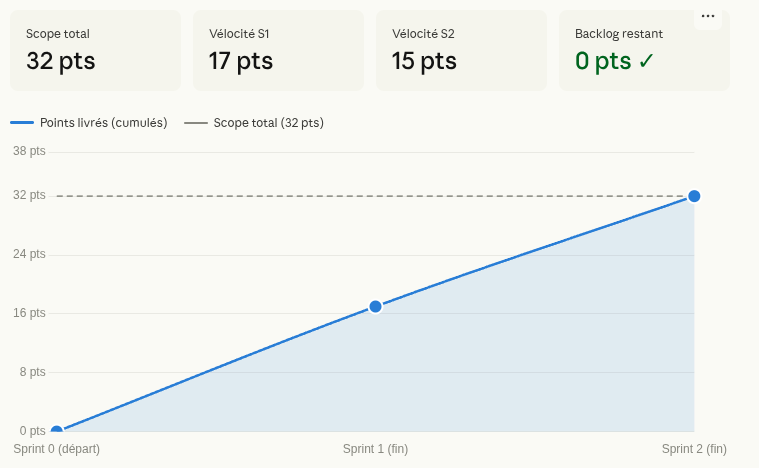
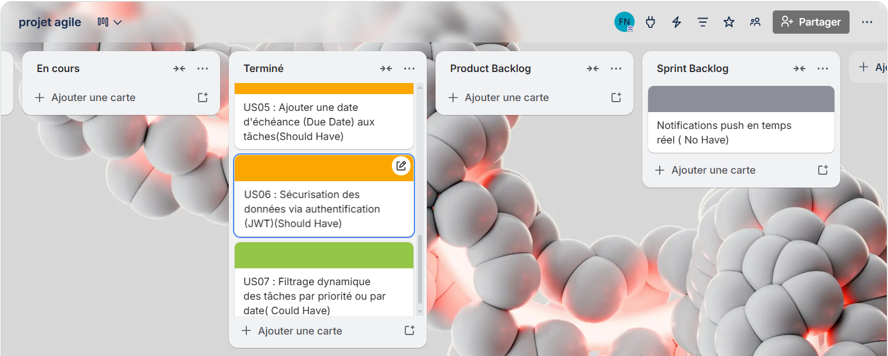

# 📋 Personal Task Manager

> Application web de gestion de tâches personnelles — organisez votre quotidien avec priorités, échéances et authentification sécurisée.

---

## L'équipe

| Membre | Rôle Scrum |
|---|---|
| TIJJA Abir | Dev |
| JEANTY Andy | Dev |
| NIANG Fama| Product Owner |
| MOUTSI Marthe Elise | Scrum master  |

---

## La vision produit

**Notre produit s'appelle :** Personal Task Manager
**Il s'adresse à :** tout utilisateur souhaitant organiser ses tâches quotidiennes
**Il permet de :** créer, prioriser, filtrer et suivre ses tâches via une interface web moderne
**Problème résolu :** la dispersion des tâches et le manque de visibilité sur les priorités et les échéances

---

## Product Backlog complet

| # | User Story | MoSCoW | Story Points | Sprint | Statut |
|---|---|---|---|---|---|
| US-01 | En tant qu'utilisateur, je veux créer une tâche avec titre et description via l'API | Must Have | 3 | 1 | ✅ |
| US-02 | En tant qu'utilisateur, je veux lister mes tâches sur un tableau de bord Angular | Must Have | 5 | 1 | ✅ |
| US-03 | En tant qu'utilisateur, je veux marquer une tâche comme terminée ou la supprimer | Must Have | 3 | 1 | ✅ |
| US-04 | En tant qu'utilisateur, je veux assigner une priorité (Basse/Moyenne/Haute) avec code couleur | Should Have | 3 | 1 | ✅ |
| US-05 | En tant qu'utilisateur, je veux ajouter une date d'échéance à mes tâches | Should Have | 3 | 1 | ✅ |
| US-06 | En tant qu'utilisateur, je veux que mes données soient sécurisées par authentification JWT | Should Have | 8 | 2 | ✅ |
| US-07 | En tant qu'utilisateur, je veux filtrer dynamiquement mes tâches par priorité ou par date | Could Have | 5 | 2 | ✅ |
| US-08 | En tant qu'utilisateur, je veux activer un mode sombre pour le confort visuel | Could Have | 2 | 2 | ✅ |

**Total Sprint 1 :** 17 pts prévus | **Total Sprint 2 :** 15 pts prévus
**Score total backlog :** 32 Story Points

---

## Sprint 1 — Ce qui a été livré

**Fonctionnalités démo-ables :**
- ✅ **US-01** — API REST Spring Boot : `POST /api/tasks`, `GET /api/tasks`, `PATCH`, `DELETE`
- ✅ **US-02** — Tableau de bord Angular : liste des tâches avec formulaire de création
- ✅ **US-03** — Marquer comme terminée (section séparée) + suppression
- ✅ **US-04** — Priorité BASSE / MOYENNE / HAUTE avec badges colorés et bordure de carte
- ✅ **US-05** — Date d'échéance avec badges : ⚠ En retard / ⏰ Aujourd'hui / À venir

**Vélocité réelle Sprint 1 : 17 pts livrés**

**Branches :**
- `feature/us01-api-creation` → PR #1 → `develop`
- `feature/us02-crud-front` → PR #2 → `develop`
- `feature/us03-tache-terminee` → PR #3 → `develop`
- `feature/us04-priority-levels` → PR #4 → `develop`
- `feature/us05-task-due-date` → PR #5 → `develop`

---

## Sprint 2 — Ce qui a été livré

**Fonctionnalités démo-ables :**
- ✅ **US-06** — Authentification JWT complète : register, login, token Bearer, interceptor Angular, guard de route, déconnexion
- ✅ **US-07** — Filtrage dynamique : 2 barres de filtres (priorité + statut échéance), combinables, sans rechargement
- ✅ **US-08** — Dark Mode : toggle 🌙/☀️ dans le header, préférence persistée en `localStorage`

**Bonus livré :** Refonte complète du design UI (design system CSS avec variables, grille 2 colonnes, formulaire horizontal, pages auth redesignées)

**Vélocité réelle Sprint 2 : 15 pts livrés**

**Branches :**
- `feature/us06-securisation-jwt` → PR #6 → `develop`
- `feature/us07-filtrage-dynamique` → PR #7 → `develop`
- `feature/us08-confort-utilisateur` → en cours → `develop`

---

## Ce qui a été reporté et pourquoi

| Fonctionnalité | Raison |
|---|---|
| Notifications push en temps réel | Hors périmètre dès le départ (Won't Have) — nécessite WebSocket, complexité trop élevée pour la durée du projet |
| Base PostgreSQL (remplacée par H2) | H2 in-memory suffisant pour la démo ; PostgreSQL prévu pour la version production |

---

## Notre Burn-up Chart



| Sprint | Story Points prévus | Story Points livrés | Cumulé réel |
|---|---|---|---|
| Sprint 1 | 17 | 17 | 17 |
| Sprint 2 | 15 | 15 | 32 |

Et voici le diagramme Scrum complet du projet — backlog, sprints et livraisons :
.png)
.png)



**Vélocité Sprint 1 : 17 pts** | **Vélocité Sprint 2 : 15 pts**
Backlog restant : 0 pts — toutes les US ont été livrées ✅

---

## Nos décisions techniques

| Choix | Décision | Pourquoi |
|---|---|---|
| Stack backend | Java 17 / Spring Boot 3.3.4 | Robustesse, Spring Security 6 intégré, écosystème mature |
| Stack frontend | Angular 17 standalone | Architecture par composants, nouveau control flow `@if/@for`, typage fort |
| Base de données | H2 in-memory | Démo sans infrastructure, create-drop automatique |
| Sécurité | JWT (JJWT 0.12.6) | Stateless, compatible API REST, standard industriel |
| CORS | GlobalCorsFilter `@Order(HIGHEST_PRECEDENCE)` | Contourne le filtre Spring Security pour les preflight OPTIONS |
| CSS | Variables CSS (`--primary`, `--card`, etc.) | Design system centralisé, dark mode via `body.dark` sans JavaScript |

**Décision d'architecture importante :** Architecture découplée frontend/backend sur deux ports distincts (4200/8080). Le token JWT est géré côté Angular via un interceptor fonctionnel (`withInterceptors`) qui injecte automatiquement `Authorization: Bearer` sur chaque requête authentifiée.

---

## Comment on a utilisé l'IA

- **Prompts qui ont bien marché :** fournir le code existant + la stack + l'US exacte en une seule fois → code directement intégrable
- **Ce que l'IA n'a pas su faire :** diagnostiquer seule que l'ancien processus backend (PID 986300) tournait encore sur le port 8080, causant des erreurs CORS inexplicables → résolu par `lsof -ti:8080` + `kill`
- **Temps gagné estimé :** ~80% sur l'écriture du code boilerplate (SecurityConfig, JwtUtil, interceptors, composants Angular)

---

## Rétrospective finale

| | Sprint 1 | Sprint 2 |
|---|---|---|
| ✓ Ce qui a marché | Structure Gitflow claire, US bien découpées, backend opérationnel rapidement | JWT fonctionnel du premier coup, filtrage sans backend, dark mode en <30min |
| △ Ce qu'on améliorerait | Démarrer le frontend plus tôt en parallèle du backend | Écrire des tests unitaires avant de passer au design |
| → Décision concrète | Toujours tuer les processus résiduels avant de relancer le backend | Centraliser les styles dans `styles.css` dès le début |

**La meilleure décision :** architecture découplée dès le départ → backend et frontend développables indépendamment
**Ce qu'on ferait différemment :** écrire la `Definition of Done` avant le Sprint 1
**Ce qu'on a appris sur l'IA :** l'IA est excellente pour générer du code si on lui donne un contexte précis, mais c'est le développeur qui diagnostique les problèmes d'infrastructure
**Ce que ça change :** l'IA accélère l'implémentation mais ne remplace pas la démarche Agile (backlog, priorisation, vélocité)

---

## Lancer le projet en local

### Prérequis
- Java 17+
- Node.js 18+ et Angular CLI (`npm install -g @angular/cli`)
- Maven (ou utiliser le wrapper `./mvnw`)

### Backend (Spring Boot)
```bash
cd backend-api
./mvnw spring-boot:run
# API disponible sur http://localhost:8080
# Console H2 : http://localhost:8080/h2-console
```

### Frontend (Angular)
```bash
cd frontend-web
npm install
ng serve
# Application disponible sur http://localhost:4200
```

### Endpoints API principaux
| Méthode | Route | Auth | Description |
|---|---|---|---|
| POST | `/api/auth/register` | ❌ | Créer un compte |
| POST | `/api/auth/login` | ❌ | Se connecter → reçoit le JWT |
| GET | `/api/tasks` | ✅ Bearer | Lister ses tâches |
| POST | `/api/tasks` | ✅ Bearer | Créer une tâche |
| PATCH | `/api/tasks/{id}/complete` | ✅ Bearer | Marquer comme terminée |
| DELETE | `/api/tasks/{id}` | ✅ Bearer | Supprimer une tâche |

---

*Projet réalisé dans le cadre du cours TRME909 — Méthodes Agiles & Management d'équipe — Master EISI 2ème année*
